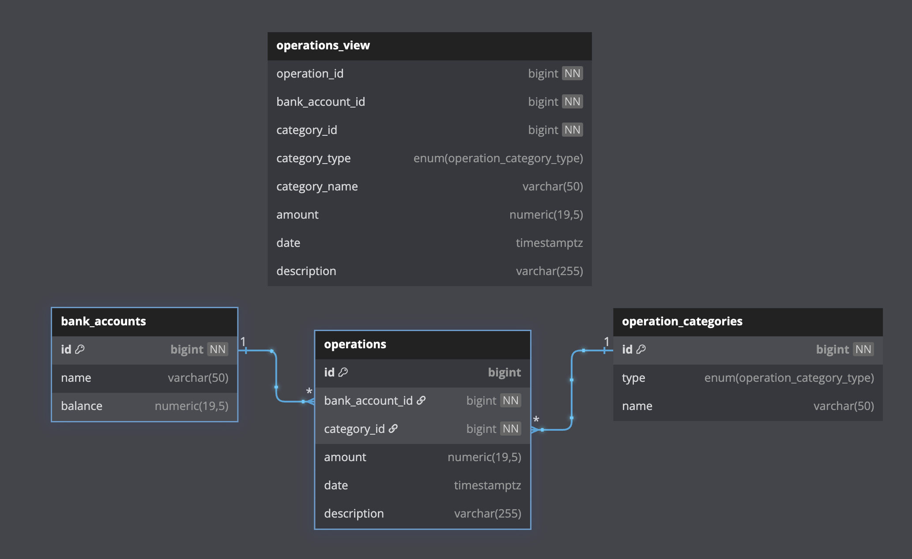

## Software Design || HSE-SE 2 course

**Демченко Георгий Павлович, БПИ-235**

### Idea of solution

**Imitation of ASP.NET Web API workflow with Clean Architecture design.**

**Custom-made app hosting solution - app representation (alike Microsoft.Extensions.Hosting ) with support for asynchronous operations and cancelattion - SD.FinancialAccounting.Hosting**

**Functions :**

- BankAccount, Operation, Operation Category CRUD with responsive account balance auto-update
- Bank account operations analytics
- Statists: Measuring execution time of all system operations / endpoints

### Boot guidance

#### Infrastructure boot

```shell
cd SD.FinancialAccounting/ && touch .env && cp .env.template .env && docker compose -f docker-compose.dev.yml up -d
```

#### Program boot

```shell
cd src/SD.FinancialAccounting.Console/ && dotnet run
```

### PgSQL Scheme



### GoF patterns

| **Pattern**  | **Usage**  |
| --------------- | --------------- |
| **Visitor**  |  Flexible data exporting without the need for modifications to exported entities - IDataVisitor (CsvVisitor, YamlCsvVisitor, JsonCsvVisitor), DataExporter |
| **Facade**  | App entrypoint / entrypoint to all app operations called via the console - AppHost / ConsoleHandler  |
| **Decorator**  | A way to add new functionality to operations/endpoints dynamicaly e.g measure executing time - ControllerActionTimerDecorator |
| **Factory**  | General, flexible interface for creating ActionHanlets ( Console action handlers to pass console inputs to controllers ) - ActionHandlerFactory |
| **Builder**  |  Flexible way to build complex objects e.g AppHost (IHost) - AppHostBuilder ( IHostBuilder )  |
| **Singleton**  | Centralized object to export data in different formats -  DataExporter |


### SOLID and GRASP

| **Principle** | **Example of usage** |
| --------------- | --------------- |
| **S**         | Separation of program workflow to weakly bound components <br> e.g AppHost -> ConsoleHandler -> ActionHanlder --> Controller --> Service --> Repository |
| **O** & **L**         | Inheritance from a base class with common functionality and its extension <br> e.g IDbRepository -> BaseRepository -> OperationsRepository <br> Dependency on abstrct type and not the concrete types <br> e.g ResponseBase -> ControllerResponse, ActionHandlerBase -> AccountActionHandler|
| **I**         | Segregation of services, repositories interfaces <br> e.g IAnalyticsService, IOperationService |
| **D**         | Controller depend on services interfaces, such as services depend on repositories interfaces, all dependencies make throught abstraction <br> e.g BankAccountController -> IBankAccountService -> IBankAccountRepository |

| **Principle**  |  **Usage** |
| --------------- | --------------- |
|  **HC & LC**  | e.g ActionHandlres, Controllers, Services and reposisotries | 
| **Information Expert** |  e.g repositories  |
| **Creator** |  e.g AppHostBuilder ( IHostBuilder )  |
| **Controller** | e.g controllers  |  
